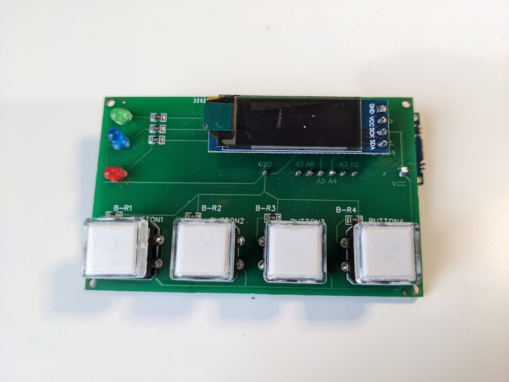
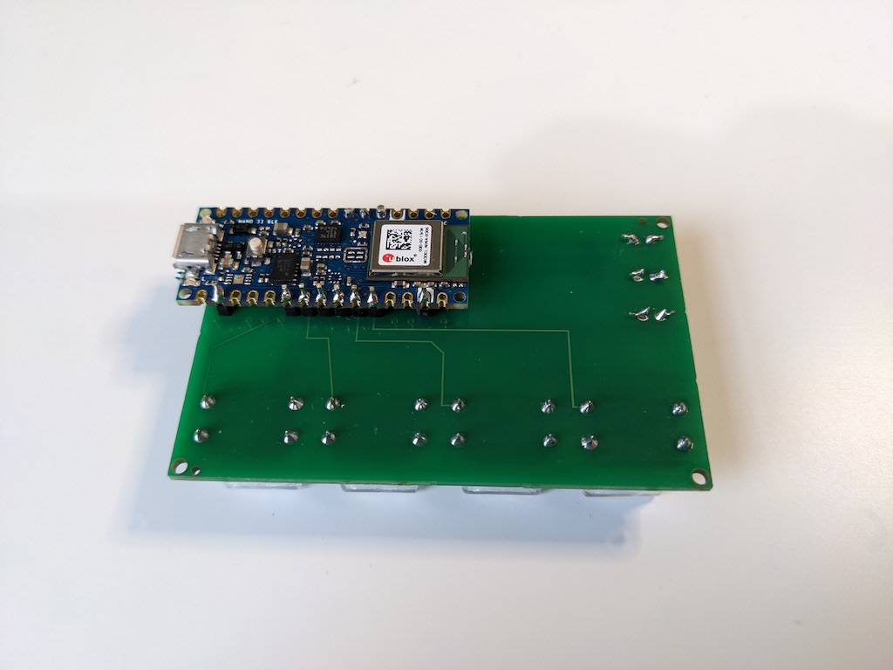
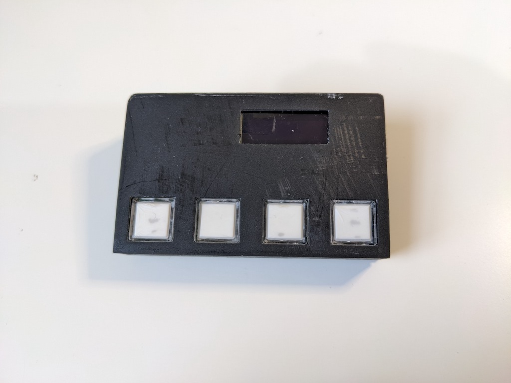
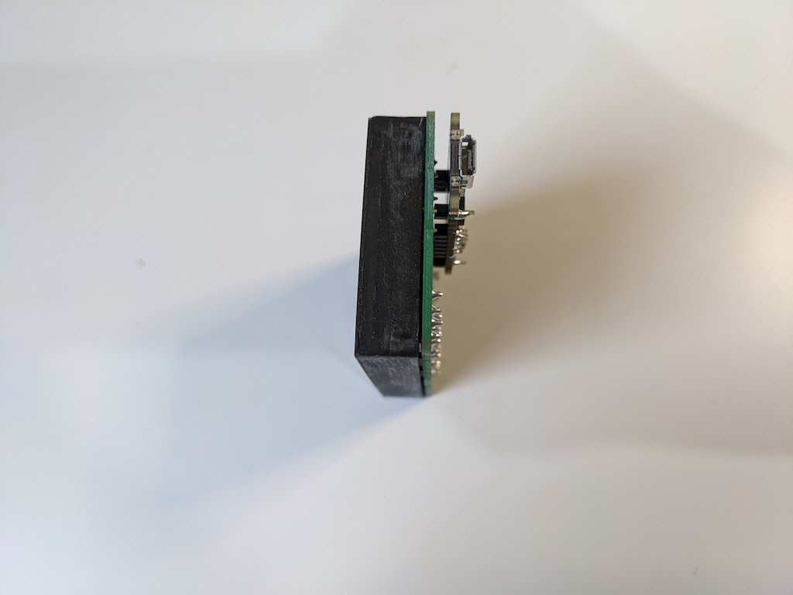
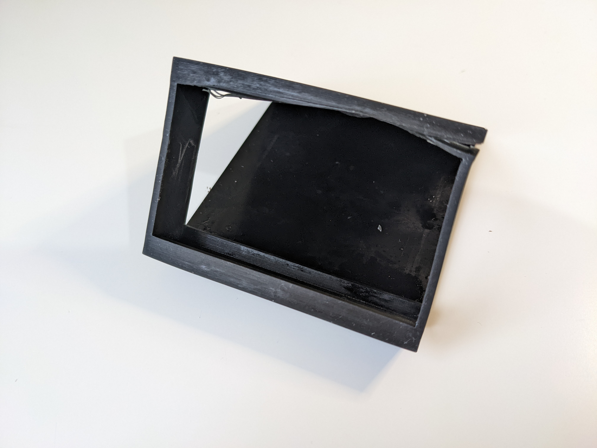
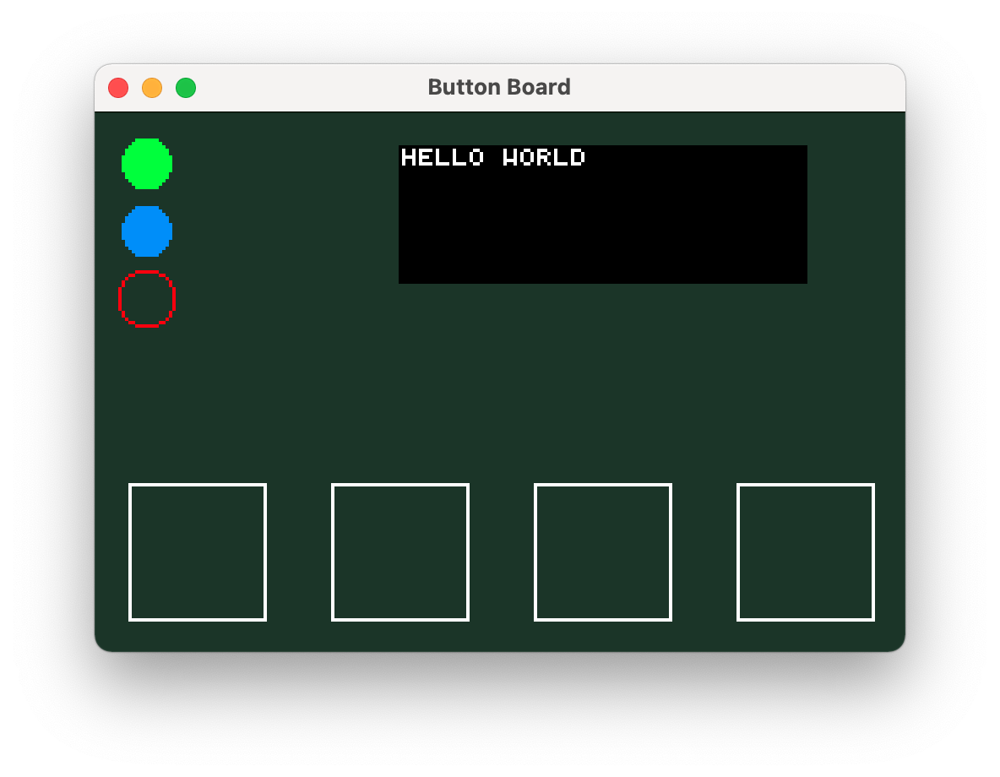
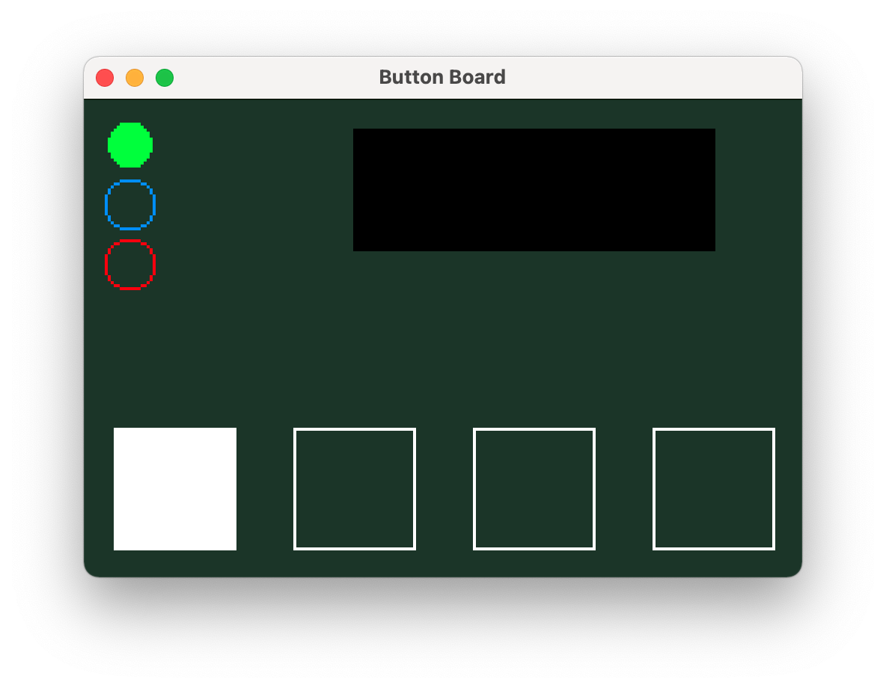

# Button Device

This project consists of a Rust library, 2 Rust desktop programs, circuit schematic and 3D models for a device with 4 buttons, 3 LEDs and a small screen that can be used with a computer.

## Technical details

The device communicates over the serial port/micro USB. It has three LEDS: green, blue and red; the blue LED is less bright than the other two. The display is 4x21 characters.

## Photos

Circuit board (Front + Back)

Board Cover

Circuit board + Cover (Front + Side)

Mount (Front + Side)

Fully assembled

(Both the cover and mount are damaged as they didn't print correctly, but the models should be correctly sized)

### Hello World Example 

**Device**

**Test Program**

When a button is pressed, the corresponding square lights up in the demo program

## Test Program

This can be used to check the device is assembled correctly.

The buttons (four squares at the bottom) light up when the corresponding physical button is pressed. Click the LEDs to set the state of the physical LED. Type printable characters and space to set text, backspace to remove the last letter.

